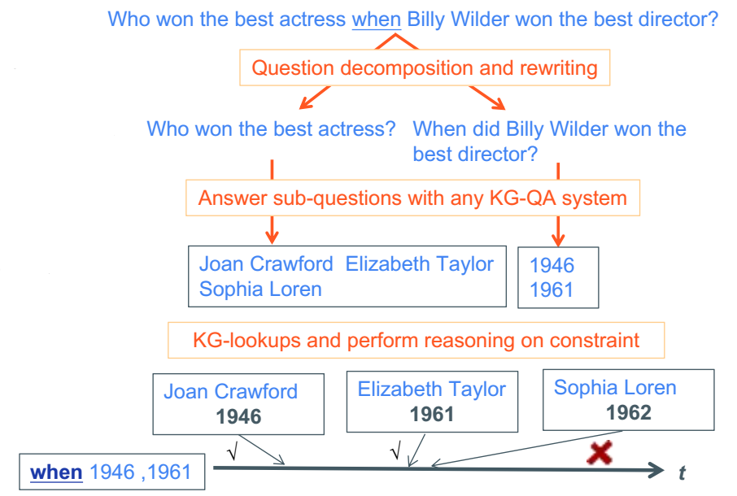

# TEQUILA + TempQuestions

Description
------
This repository contains the code and data for our CIKM'18 short paper. In this paper, we present TEQUILA, an enabler method
for temporal QA that can run on top of any KB-QA engine. TEQUILA has four stages. It detects if a question has temporal intent. It decomposes and rewrites the question into non-temporal sub-questions
and temporal constraints. Answers to sub-questions are then retrieved from the underlying KB-QA engine. Finally, TEQUILA uses
constraint reasoning on temporal intervals to compute final answers to the full question. Comparisons against state-of-the-art
baselines show the viability of our method. 

<center></center>

*An example of TEQUILA pipeline including the steps of "decompose and rewrite", "answer sub-questions", and "reason on time intervals".*

For more details see our paper: [TEQUILA: Temporal Question Answering over Knowledge Bases](https://arxiv.org/abs/1908.03650) and visit our project website: https://tequila.mpi-inf.mpg.de.

If you use this code, please cite:
```bibtex
@inproceedings{jia:18b,
 author = {Jia, Zhen and Abujabal, Abdalghani and Saha Roy, Rishiraj and Str\"{o}tgen, Jannik and Weikum, Gerhard},
 title = {{TEQUILA: Temporal Question Answering over Knowledge Bases}},
 booktitle = {Proceedings of the 27th ACM International Conference on Information and Knowledge Management},
 series = {CIKM '18},
 year = {2018},
 isbn = {978-1-4503-6014-2},
 location = {Torino, Italy},
 pages = {1807--1810},
 numpages = {4},
 url = {http://doi.acm.org/10.1145/3269206.3269247},
 doi = {10.1145/3269206.3269247},
 acmid = {3269247},
 publisher = {ACM},
 address = {New York, NY, USA},
 keywords = {question answering, question decomposition, temporal questions},
}
```

If you face any issues when using the code please feel free to contact Zhen Jia (zjia@swjtu.edu.cn), Rishiraj Saha Roy (rishiraj@mpi-inf.mpg.de) or Gerhard Weikum (weikum@mpi-inf.mpg.de).
